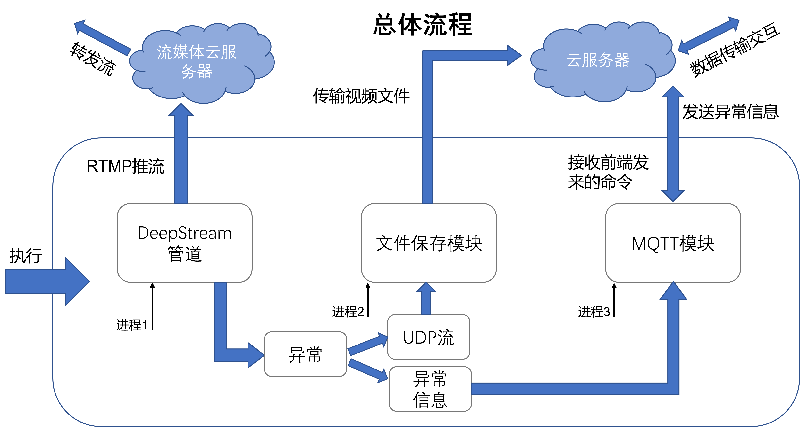

# :camera:Nano AI Camera

核心处理板使用NVIDIA的Jetson-Nano-4G，计划实现使用Nano作为边缘处理板来做AI智能监控摄像头，能够在一些特定场景下实现边缘端的AI智能处理而不是传统方式将视频流传输到云端进行检测再返回监测信息，因此使用nano作为边缘AI处理可以实时地进行处理返回实时监测信息极大程度上提升了实时性。再配合5G基站利用5G的低时延性和高速传输性就可以在整个特定场景或者园区内实现智慧管理。


# :department_store:整体框架

整体框架使用以NVIDIA官方提供的Deepstream流媒体作为主要执行框架（Deepstream提供了极其方便的流媒体编解码以及流媒体视频中AI模型检测的接口等）；消息传输方面使用MQTT协议作为核心板和云端通信的基础方式同时也是便于和web/app等程序后端进行订阅获取信息；流媒体视频传输方面使用RTMP作为实时视频传输的协议；文件保存方面设置单独的进程使得这个文件保存进程一直执行设定一段时间内的视频保存，当有异常信息即中断信息进入则保存视频文件否则视频文件释放销毁。



# :boom:相机ISP调色

- 下载camera-override.isp文件，解压到特定文件夹

```
wget http://www.waveshare.net/w/upload/e/eb/Camera_overrides.tar.gz
```

- 解压并且移动

```
tar zxvf Camera_overrides.tar.gz 
sudo cp camera_overrides.isp /var/nvidia/nvcam/settings/
```

- 安装文件

```
sudo chmod 664 /var/nvidia/nvcam/settings/camera_overrides.isp
sudo chown root:root /var/nvidia/nvcam/settings/camera_overrides.isp
```

- 重新启动测试

# :rocket:开机自启动设置

- 打开设置点击用户账户，然后点击右上角解锁，再打开自动登录
- 创建shell文件

```
sudo gedit start.sh
```

- 添加以下内容

```
#!/bin/bash
cd /home/nvidia/Nano/Main/
python3 main.py
```

- 添加shell到开机自启动目录里，终端输入

```
gnome-session-properties
```

- 点击添加，在命令栏输入

```
gnome-terminal -x /home/nvidia/Nano/Main/start.sh
```

- 给文件赋予权限

```
sudo chmod a+x start.sh
```

- 重启测试

# :wrench:如何部署整个项目

- 安装好DeepStream6.0[官方安装文档](https://docs.nvidia.com/metropolis/deepstream/dev-guide/text/DS_Quickstart.html#jetson-setup)
- 安装好Gst-Python(Jetson系列板子已经自带了所以没必要再安装)

```
如果没装
sudo apt update
sudo apt install python3-gi python3-dev python3-gst-1.0 -y
```

- 安装好Python3.6(Jetson系列板子已经自带)
- 安装好Ubuntu18.04(Jetson系列板子已经自带)

- DeepStream Python bindings[官方参考](https://github.com/NVIDIA-AI-IOT/deepstream_python_apps/blob/master/bindings/README.md)

```
git clone https://github.com/NVIDIA-AI-IOT/deepstream_python_apps.git
cd deepstream_python_apps/bindings
mkdir build
cd build
cmake ..  -DPYTHON_MAJOR_VERSION=3 -DPYTHON_MINOR_VERSION=6 \
    -DPIP_PLATFORM=linux_aarch64 -DDS_PATH=/opt/nvidia/deepstream/deepstream-6.0/
make

pip3 install ./pyds-1.1.0-py3-none*.whl
```

- 将该项目全部搬到jetson的home目录下然后运行main.py即可
